#  CSS3 조

[](https://karly-css3.netlify.app/index.html)

> 배포주소 : [마켓칼리 웹페이지](https://karly-css3.netlify.app/)  
> HTML & CSS 이용하여 마켓 칼리 페이지 구현  
> 프로젝트 기간 : 2023.06.23-2023.06.28 (총 4일)  
> 기술스텍  
>      

</br></br>

## 역할분담 및 이미지

- 공통: 리드미 작성

  > 정지영 : main , 회원가입 (상단-input list)  
  > 김민성 : header, 파비콘 , nav , 회원가입 (하단 - 약관동의) , 각 페이지 header & footer 삽입  
  > 장현주 : footer , aside badge , 상품 리스트 페이지  
  > 송영은 : 스크럼 마스터 , login , cart , 리드미 통합

    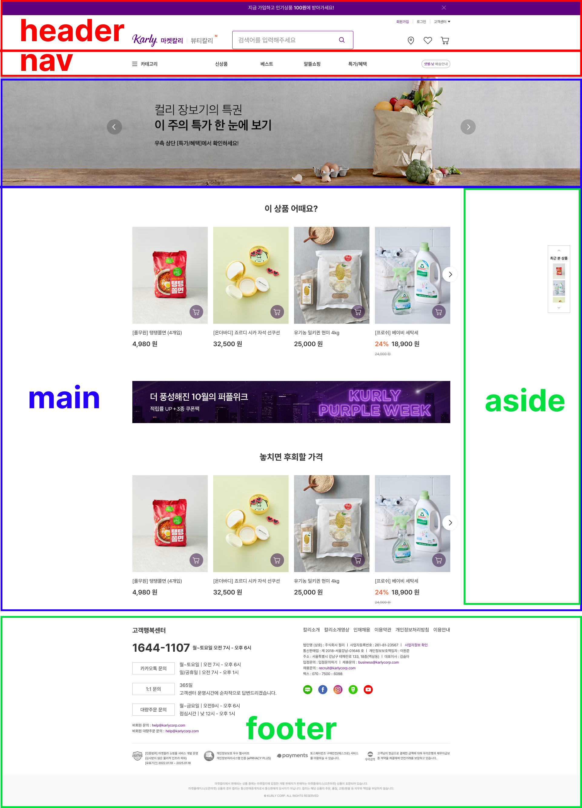
    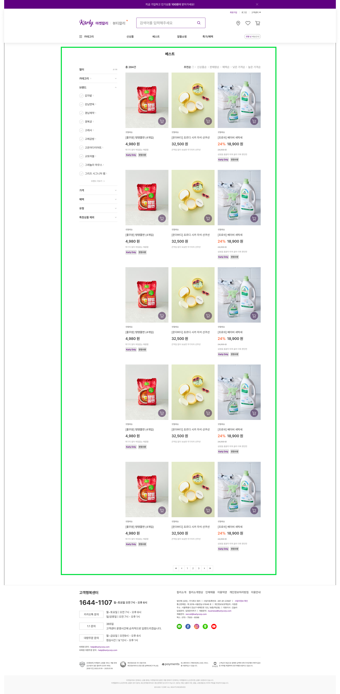
    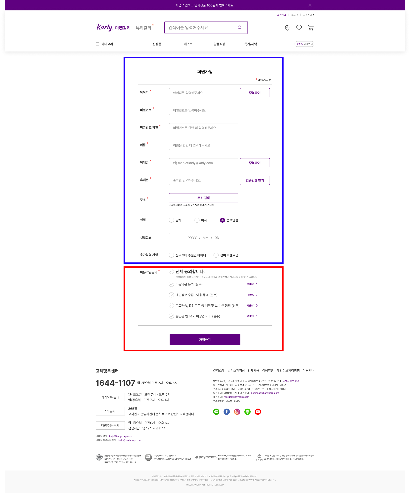
    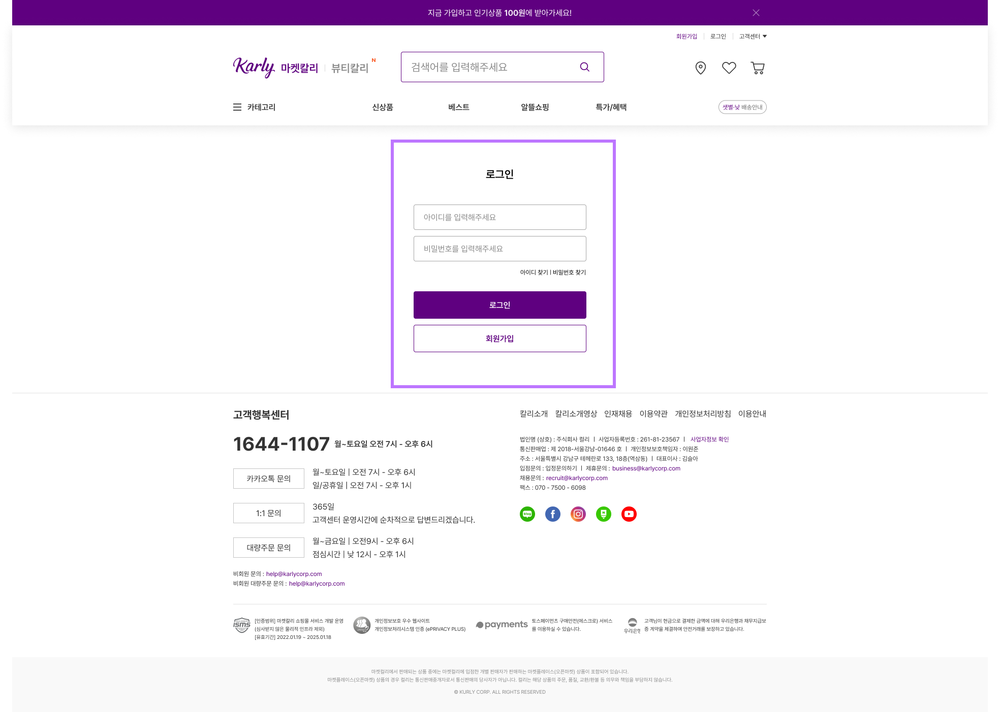
    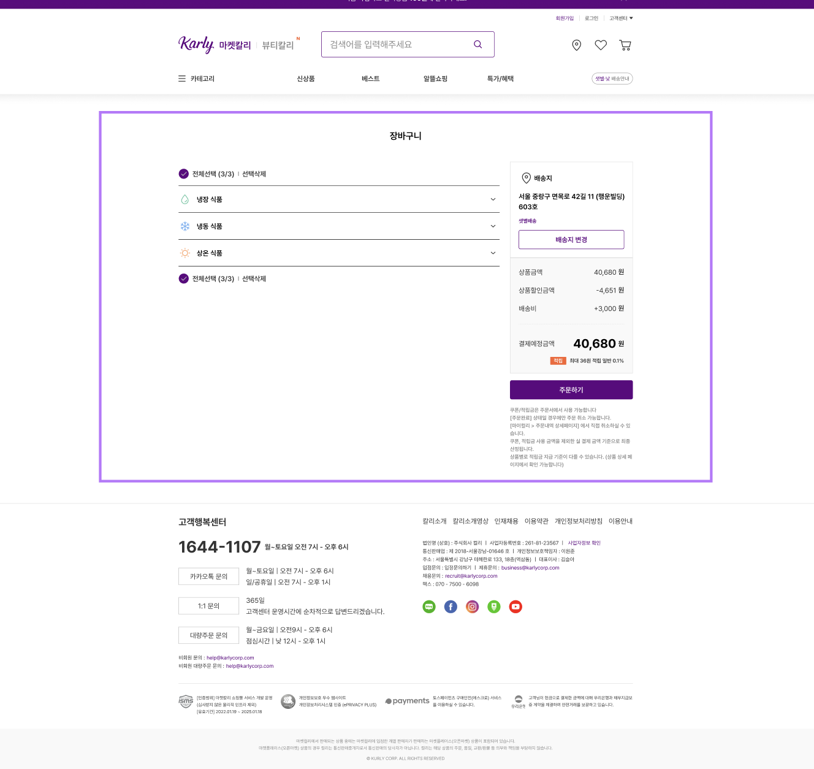

</br></br>

## 한줄평 & 소감

> 💙 정지영 : 한줄평 : 프로젝트를 하며 팀원들과 git으로 협업하는 방식을 배울 수 있어서 좋았습니다. 협업시 부딪칠 수 있는 문제들을 커뮤니케이션을 통해 함께 해결해 나가는 과정이 유익했습니다.  
> ❤️ 김민성 : 프로젝트를 하면서 몰랐던 css와 html 의 여러 코드를 알 수 있었고, 그 과정을 통해 많이 배울 수 있어서 좋았습니다.  
> 💚 장현주 : 프로젝트를 진행하면서 다양한 에러와 부딪히고 해결하면서 많이 성장할 수 있었습니다. 또 이해를 잘 하지 못한 개념들도 익히게 되면서 프로젝트를 완성할 수 있어 좋은 경험이 되었습니다.  
> 💜 송영은 : 프로젝트 진행하는 동안 git과 팀원들과 협업을 배울수 있어서 즐거웠습니다.

</br></br>

## 가이드라인 준수 사항

- 각페이지 유효성 검증 완료 하였습니다.
- 이미지의 경우, 대체 텍스트 제공했습니다.
- 크로스 브라우징 체크 했습니다. (Chrome, Firefox, Safari, Edge)
- 체크박스 명도대비가 약한 곳을 부분적으로 아이콘 이미지를 변경했습니다.
- 웹 접근성 향상을 위해 X , | 등 읽지 않아도 되는 표시자에는 aria-hidden 속성을 부여했습니다.
- 클래스에 "a11yHidden"을 부여하여 스크린 리더 사용자에게 목적을 알려주고, 해당 요소를 화면에서 숨김 처리하였습니다.

</br></br>

## 네이밍 컨벤션

> 부모영역 : camel case (searchForm)  
> 자식영역 : snake case (searchForm\_\_group)

</br></br>

<details>
<summary style="font-size: 21px;"> 믹스인 </summary>
<div markdown="1">

> base

- 에이전트 스타일 초기화 (normalize,reset)

> a11y

- `@mixin a11yHidden`

  웹접근성 고려한 컨텐츠 숨기기
  (스크린 리더 사용자에게는 읽혀지지만 시각적으로는 숨김 처리)

> color, spacing

- `$primary-color: #5f0080; 
$secondary-color: #bd76ff;` 마켓칼리 대표색상 변수 지정
- `$spacing` px 별로 변수값을 지정했습니다.

> unit

- `@function rem`
  px단위를 rem으로 변경하는 함수를 사용했습니다.

> mixin

- `@mixin flexbox` 플렉스 방향, 정렬 방식, 항목 정렬 방식, 줄 바꿈 여부를 설정할 수 있습니다.

- `@mixin containerMax`
  최대화면 크기를 1050px 지정하고 auto 마진값을 화면 중앙에 정렬.

- `@mixin autoMargin`
  마진값을 auto로 주어 화면 중앙에 정렬

- `@mixin padding,@mixin margin`
  콘텐츠의 패딩,마진 값을 부여 했습니다.

- `@mixin gridbox`
  그리드의 컬럼의 개수, 컬럼의 너비, 행 간격, 열 간격을 설정할 수 있습니다.

- `@mixin gray300_button  `
  라이트 색상을 적용한 버튼 style

- `@mixin button`
  칼리 대표 버튼 스타일 지정 하였습니다.

- `@mixin input`
  컬리 대표 input 스타일 지정 하였습니다.

- `@mixin font`
  칼리 대표 font 스타일 지정 하였습니다.

- `@mixin buttonNone `
  버튼 기본 스타일 제거

- `@mixin bgImages`
  배경이미지 반복제거, 크기 100% 지정

</details>

</br>

<details>
<summary style="font-size: 21px;"> 플로우(링크) </summary>
<div markdown="1">

## 화면 플로우

  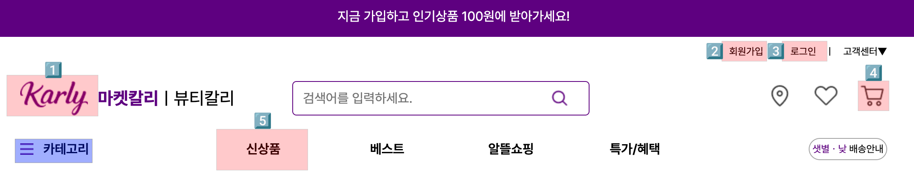

- red : 클릭시 페이지 이동
- blue : 호버시 메뉴 카테고리 보임

1. [메인 페이지](https://karly-css3.netlify.app/)
2. [회원가입](https://karly-css3.netlify.app/views/join.html)
3. [로그인](https://karly-css3.netlify.app/views/login.html)
4. [장바구니](https://karly-css3.netlify.app/views/cart.html)
5. [신상품](https://karly-css3.netlify.app/views/productlist)

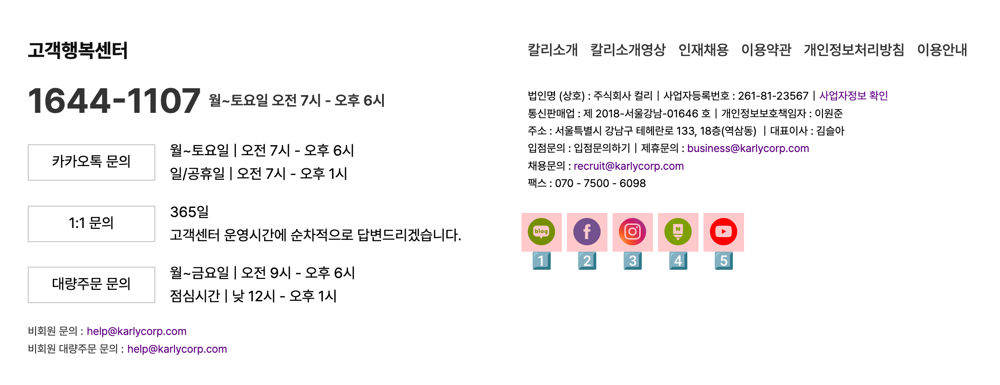

- red : 클릭시 페이지 이동

1. [컬리 네이버 블로그](https://blog.naver.com/marketkurly)
2. [컬리 페이스북](https://www.facebook.com/Marketkurly/)
3. [컬리 인스타그램](https://www.instagram.com/marketkurly/)
4. [컬리 네이버 포스트](https://m.post.naver.com/marketkurly)
5. [컬리 유튜브](https://www.youtube.com/channel/UCfpdjL5pl-1qKT7Xp4UQzQg)

</details>
</br></br>

## 코드리뷰

<details>
<summary>main : header  </summary>
<div markdown="1">

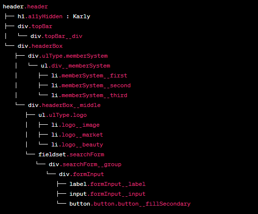

> topBar
>
> > primary-color 부여

> headerBox
>
> > flex로 column 형식 부여
> > div\_\_memberSystem
> >
> > > flex로 row 형식 부여하여 회원가입|로그인|고객센터 구현

> > headerBox\_\_middle
> >
> > > logo
> > >
> > > > flex로 row 형식 부여하여 로고와 마켓칼리 글자 형태 구현

> > > searchForm
> > >
> > > > 검색창 구현

> > > imoji
> > >
> > > > flex로 row 형식 부여하여 location, heart, shopping 배치

</br>
</br>

#### 1. 제목 등 보이지 않아도 되는 성질에 a11yHiddne class로 숨김처리 했습니다.

</br>

#### 2. 웹 접근성 향상을 위해 X , | 등 읽지 않아도 되는 표시자에는 aria-hidden 속성을 부여했습니다.

</br>

#### 3. 대부분의 코드에 부모-자식 간의 class연결성을 만들어두어 scss에서 편하게 구조화하고, 편하게 볼 수 있도록 구성하였습니다. (ex. searchForm(부모) - searchForm\_\_group(자식))

</br>

#### 4. label과 legend, ul 등을 최대한 적재적소에 사용하여 더욱 코드를 symentic하게 구성하였습니다.

</br>
</br>
</div>
</details>

<details>
<summary>main : navigation</summary>
<div markdown="1">

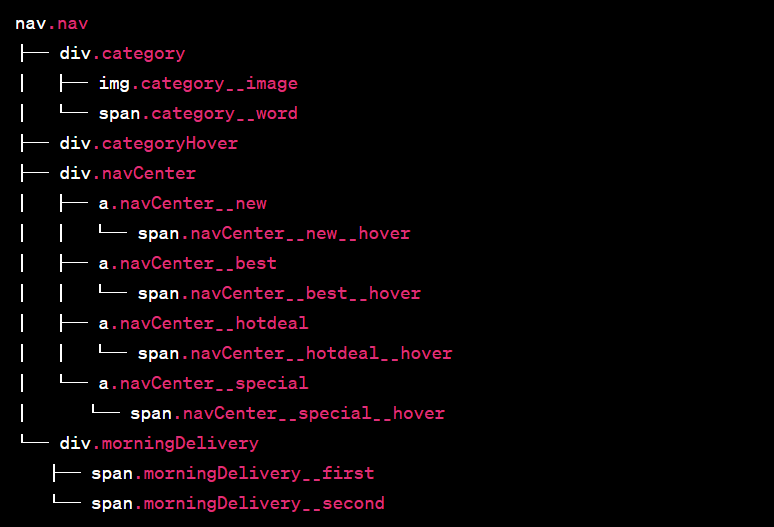

> category
>
> > 자식요소인 categoryHover에 absolute주기 위해 relative 부여
> > </br>
> > Hamburger와 카테고리 부분 배치 위해 flex로 row 형식 부여
> > </br> > > </br>
> > categoryHover
> >
> > > flex형식으로 column주어 세로형식 배치
> > > </br>
> > > justify : space-evenly 형식으로 균등배치
> > > </br>
> > > 기본 형식 visibility : hidden으로 숨김처리
> > > </br> > > > </br>
> > > .category:hover > .categoryHover
> > >
> > > > category에 hover시 하위내역인 categoryHover에 변경사항 부여
> > > > </br>
> > > > visibility : visible 으로 보이게 처리
> > > > </br>
> > > > top : 40px 으로 위치 부여
> > > > </br> > > > > </br>
> > > > 이후 각 카테고리 별 이미지 sprite로 부여

</br>
</br>

> navCenter
>
> > flex를 row형식으로 주어서 상단 nav바 배치
> > </br> >> **new , **best , **hotdeal , **special
> >
> > > 각 상자별 flex 위한 넓이 부여
> > > </br>
> > >
> > > > hover
> > > >
> > > > > hover시 글자 색깔 변화 및 및줄 부여

</br>
</br>

> morningDelivery
>
> > 상자 배치 및 내부 글자 색깔 변경
> > </br>
> > 상자 내부 flex형태 row 부여

</br>
</br>

#### 1. 카테고리 구성 중 다른 페이지와 class이름이 겹치는 상황이 발생하여, 다음에 프로젝트를 진행 시 평범한 class명 대신 unique하게 만들어야겠다고 생각했습니다.

</br>

#### 2. 다양한 이미지에 대체텍스트를 부여하여 접근성을 높혔습니다.

</br>

#### 3. 공통적으로 들어가는 부분을 mixin으로 대체하면 좋았을 것 같다고 생각됩니다. ex(너비, flex와 justify 등)

</br></br>

</div>
</details>

<details>
<summary>main : main</summary>
<div markdown="1">
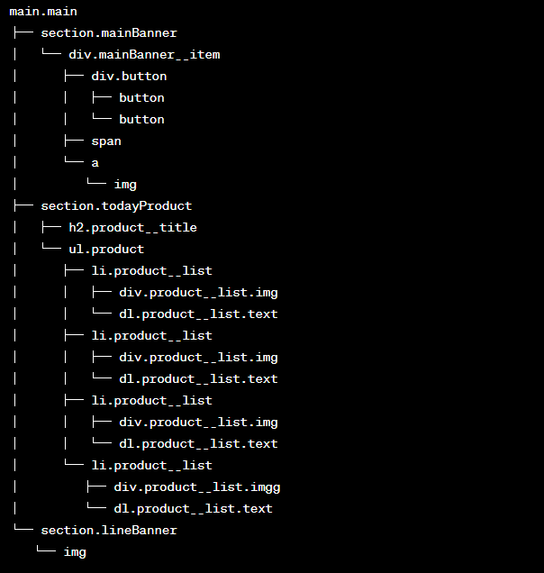

## Main (마크업 트리 구조)

- main
- section

1. mainBanner
2. todayProduct
3. lineBanner
4. todayProduct

---

- `main`: 전체 컨텐츠를 감싸는 가장 큰 요소입니다.
- `section` : 하위에 여러 섹션 요소들을 포함합니다.

1. `mainBanner 섹션:`
   메인 배너를 표시하는 섹션입니다. 하위에 mainBanner**item 요소가 있습니다.
   mainBanner**item 요소 내부에는 배너 이미지를 포함한 버튼 요소들이 있습니다.

2. `todayProduct 섹션:`
   "이 상품 어때요?"와 "놓치면 후회할 가격" 상품 목록을 표시하는 섹션입니다.
   product**title 클래스를 가진 제목 요소가 있습니다.
   product 클래스를 가진 목록 요소가 있습니다.
   목록 요소 내부에는 여러 상품을 나타내는 product**list 요소들이 있습니다.
   각 product\_\_list 요소에는 이미지, 버튼, 상품 정보를 나타내는 하위 요소들이 포함되어 있습니다.

3. `lineBanner 섹션:` 메인 이미지 배너를 표시하는 섹션입니다.

4. 2번 섹션과 동일한 `상품 리스트 섹션`입니다.

---

### 1. mainBanner

1. Markup :
   메인 배너의 마크업 구조는 `section > div > div.button*2 > span(1/5 슬라이드 넘버) >   <a></a>` 으로 배너 이미지는 a태그로 감싸서 링크 연결 시 페이지 이동이 가능하게 만들었고, 버튼은 div로 묶어 중앙 양측에 배열 할 수 있도록 했습니다.

2. CSS :
   메인 배너의 섹션은 `position : relative`로 상대적 위치를 주고, 버튼 및 슬라이트 넘버의 span태그는  
   `position : absolute`로 절대적 위치를 주어 배너 영역 안에 배치되도록 했습니다.

### 2. todayProduct

1. Markup :
   이 상품 어때요? 의 상품 리스트의 틀은 `ul > li`로 마크업하고, 이미지 부분은 `div`태그로 감쌌습니다.  
   상품명 텍스트는 정의 리스트는 li 하위에 `dl > dt > dd` 구조로 마크업 했습니다.

2. CSS :
   상품 리스트의 `li`부분은 `display : flex`와 row 정렬로 가로 배치하고 이미지 부분은 relative,  
   button은 `absolute`로 이미지 안에 배치했습니다.
   오른쪽 슬라이드 화살표 아이콘은 `li`에 relative, `.btn-arrow-right`에 absolut를 주어 오른쪽 중앙에 배치했습니다.

### 3. lineBanner

1. Markup : 라인 배너는 색션 영역에 이미지 태그를 주어 중앙에 배채했습니다.
2. CSS : margin-top을 주어 상품 리스트와 간격을 조정했습니다.

### 4. todayProduct : 2번과 동일

</br></br>

  </div>
</details>
  
  <details>
<summary>main : footer</summary>
<div markdown="1">

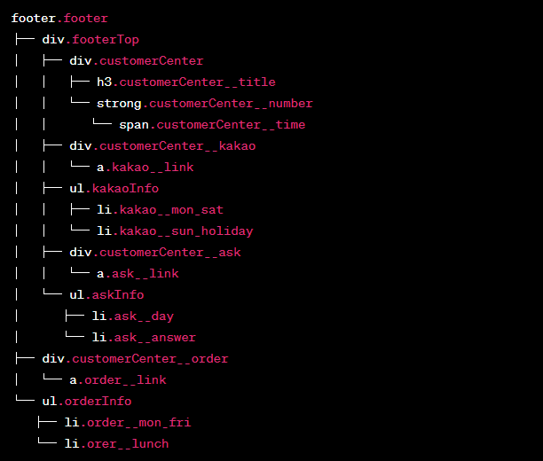

## footer

`<footer>`는 '마켓칼리' 웹 페이지의 하단에 위치한 푸터(footer)를 구성하는 요소들로 제작되어 있습니다.

### 구성 요소

> 고객 행복 센터

마켓 칼리를 이용하는 고객의 주문 및 문의를 위한 영역을 구성하였습니다.

1. 고객 행복 센터 안내 및 문의 가능 시간 고지

- `<h2>` title 역할로 고객행복센터 제목을 표시합니다.
- `<strong>`을 사용하여 문의 번호를 강조하였습니다.
- `<a>`태그를 활용하여 각각의 문의로 연결되는 버튼을 만들고, `<ul>, <li>`태그를 활용하여 해당 문의에 대한 정보를 표기하였습니다.

> 칼리 정보 2. 칼리 소개 및 이용약관, 기타 정보 안내

- `<ul>,<li>`태그를 활용하여 칼리의 여러 정보에 대하여 구성하였습니다.
- `<div> > <p>`를 사용하여 법인 정보를 표기하였습니다.
- `<ul>, <li>`로 다양한 SNS로 이동할 수 있는 버튼을 제작했습니다.

> 인증 범위 3. 마켓 칼리의 인증 범위와 페이 서비스 안내

- `, <p>`태그를 활용하여 인증 범위를 표기하였습니다.

> 마켓 칼리 Copyright 4. copyright

- 마켓 칼리의 copyright 정보를 표기하였습니다.

<br>

  </div>
</details>

<details>
<summary>main : aside</summary>
<div markdown="1">
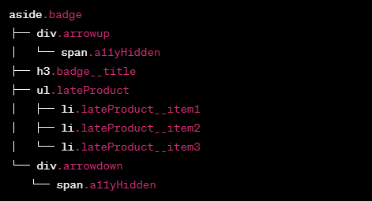
 
## aside
```<aside>```는 '마켓칼리' 웹 페이지의 우측에 위치한 '최근 본 상품' 영역을 구성하는 요소들로 제작되어 있습니다.

### 구성 요소

> 최근 본 상품

1. 칼리 서비스를 이용하며 최근 본 상품을 순서대로 확인할 수 있습니다.

- `<aside>, <div>, <ul>, <li>`태그롤 마크업을 진행했습니다.

<br>

 </div>
</details>

<details>
<summary>회원가입 페이지 (join)</summary>
<div markdown="1">
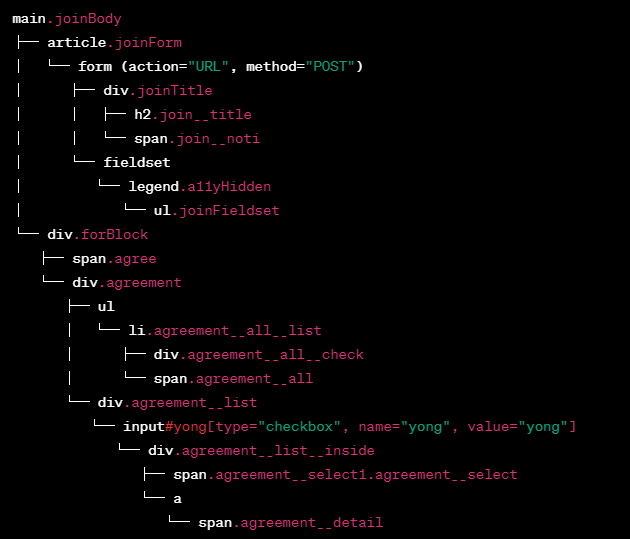

## join (회원가입 마크업 트리 구조)

- main
- article

1. div (title)
2. form > fieldset > ul > li (labe + input)

---

### 1. div (title)

1. Markup : fieldset의 legend 요소엔 a11yHidden 클래스를 주어 숨김처리 하였고,
   h2 태그를 활용해 `회원가입` 타이틀을 표시했습니다. 하단 \*필수입력표시 부분은 span태그와 `sup` 태그로 별모양 처리했습니다.

2. CSS : 피그마 시안에 맞는 폰트 사이즈 적용 및 간격을 조정했습니다.

### 2. form > fieldsetul > li (labe + input)

1. Markup :
   각 항목에 맞는 input type을 주어 마크업 했습니다.
   -> 아이디(text), 비밀번호(password), 이름, 이메일(email), 휴대폰(tel), 주소, 성별(라디오), 생년월일(date), 추가입력 사항(라디오)
2. CSS :
버튼과 인풋은 믹스인을 통해 컴포넌트화 시켜서 스타일을 적용했습니다.
라디오 버튼과 input의 data 타입은
</br></br></br>
</div>
</details>

<details>
<summary>로그인 페이지 (login)</summary>
<div markdown="1">
  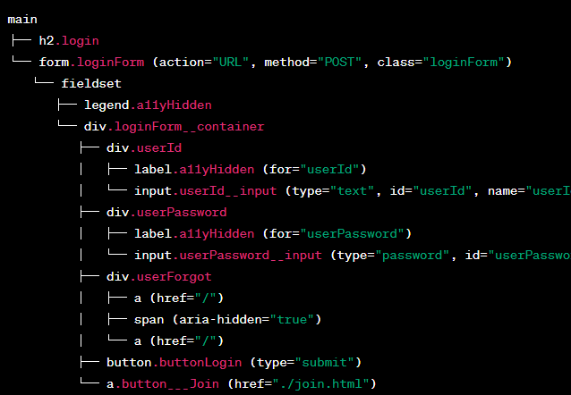

### 로그인 페이지

- 페이지 제목
  > `<h2>` 요소를 사용하여 페이지 제목을 "로그인"으로 지정했습니다.  
  > `<form>` 로그인 정보를 입력하기 위한 폼태그를 지정했습니다.  
  >  `<fieldset>`
  > 그룹화 하였습니다.  
  >  `<legend> <label>` 클래스 a11yHidden 부여하여 "로그인 정보 입력" 텍스트를 사용하여 스크린 리더가 폼의 목적을 알 수 있도록 하고 숨김처리 하였습니다.  
  > `<input>`에 `required` 속성을 사용하여 반드시 값을 입력하도록 하였습니다.`placeholder` 속성으로 입력 필드에 힌트 텍스트를 제공했습니다.
- 로그인 버튼
  > `<button>` 로그인 버튼을 마크업 하고 type 속성은 "submit"으로 설정되어 폼이 제출되게 하였습니다.
- 회원가입 버튼
  > `<a>` 요소를 사용하여 회원가입 버튼을 디자인하고, href 속성은 회원가입 페이지의 URL을 나타냈습니다.

</br></br></br>

</div>
</details>

<details>
<summary>장바구니 페이지 (cart)</summary>
<div markdown="1">

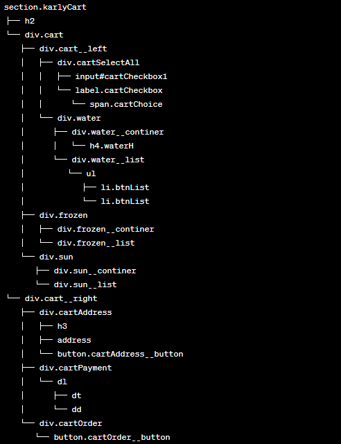

- 페이지 제목

  > `<h2>` 페이지 제목을 "장바구니"으로 지정 했습니다.  
  > `<section>` 장바구니 전체 영역을 감싸는 컨테이너로 사용했습니다.

- 왼쪽 영역

  > `<label tabindex="0"> `  
  > 체크박스 아이콘 명도대비가 낮아서 이미지를 변경하였습니다.
  > 키보드로도 접근 및 조작이 가능하도록 tabindex 부여

  > `input[type="checkbox"]`  
  >  기본속성을 제거하고 클릭시 이미지가 변경되도록 하였습니다.

  > ` <span aria-hidden="true">ㅣ</span>`  
  > aria-hidden="true" 보이지만 읽어주지 않도록 하였습니다.

  > `<button type="submit" class="cartButton">선택삭제</button>`  
  > 기본 버튼 속성을 제거한 후, 택스트가 클릭되게 하였습니다.

- 오른쪽 영역
  > 배송지  
  >  `<h3>` 배송지 제목을 나타내는 요소입니다.  
  > `<address>` 배송지 주소를 나타내는 요소입니다.  
  > `button.cartAddress__button`: 배송지 변경 버튼입니다.  
  > 결제 정보  
  >  `<dl><dt><dd>` 정의형 리스트를 사용하여 마크업 하였습니다.  
  > 주문하기  
  >  `button.cartOrder__button`

</br></br>

</div>
</details>

<details>
<summary>상품페이지 (productList)</summary>
<div markdown="1">

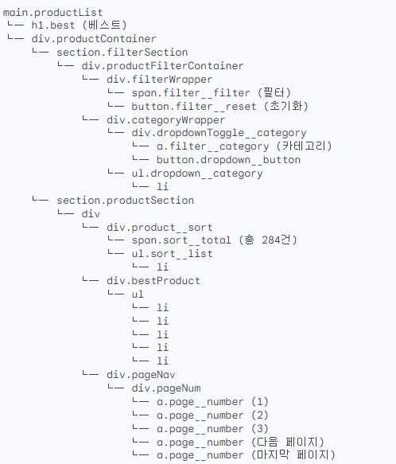

## product list

product list는 베스트 상품 리스트를 안내합니다.

### 구성 요소

> 제목

1. 베스트 상품 페이지에 대한 타이틀을 안내합니다.

- `<h1>`태그를 사용하여 제품 페이지의 제목을 지정하였습니다.

> 필터 2. 베스트 상품들을 필터링하여 확인할 수 있는 탭 입니다.

- `<label>, <input>`을 활용하여 필터를 지정할 수 있는 체크박스를 구성하였습니다.

> 상품 리스트 3. 베스트 상품을 조회한 상품 리스트를 안내합니다.

- `<ul>,<li>`태그를 활용하여 조회된 제품을 원하는 순서로 확인할 수 있는 버튼을 구현했습니다.
- `<dl>,<dt>,<dd>`태그로 제품 리스트와 제품정보를 안내합니다.

> 페이지 버튼 4. 해당 페이지로 이동할 수 있는 페이지 버튼을 구성하였습니다.
> `<div>, <a>`태그를 활용하여 해당 페이지로 이동할 수 있는 버튼을 구성하였습니다.

</div>
</details>
